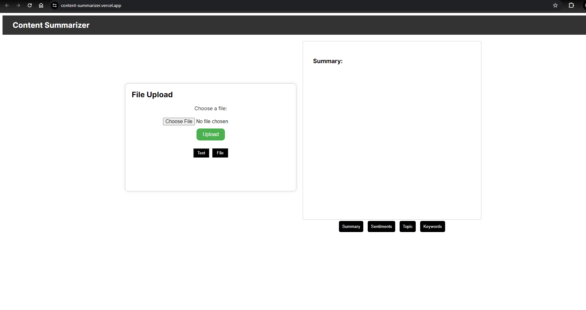
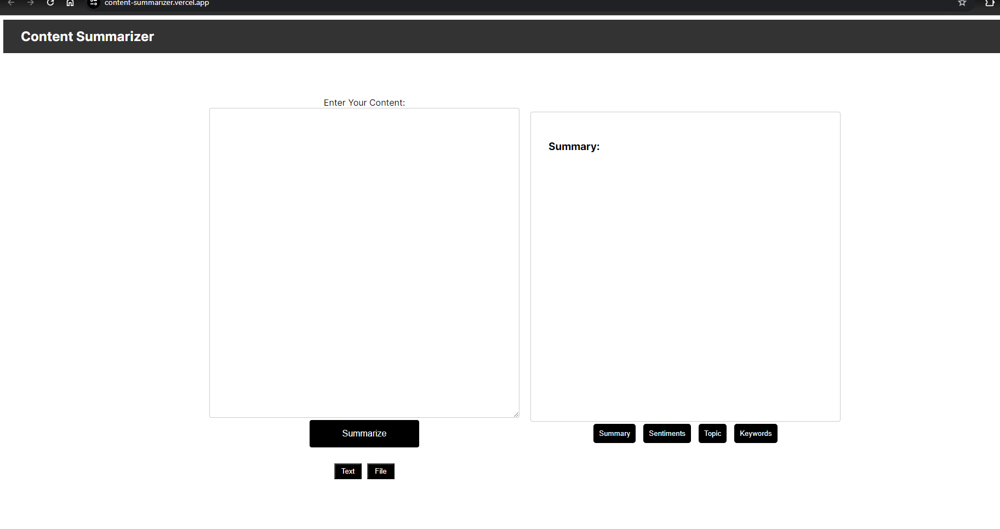
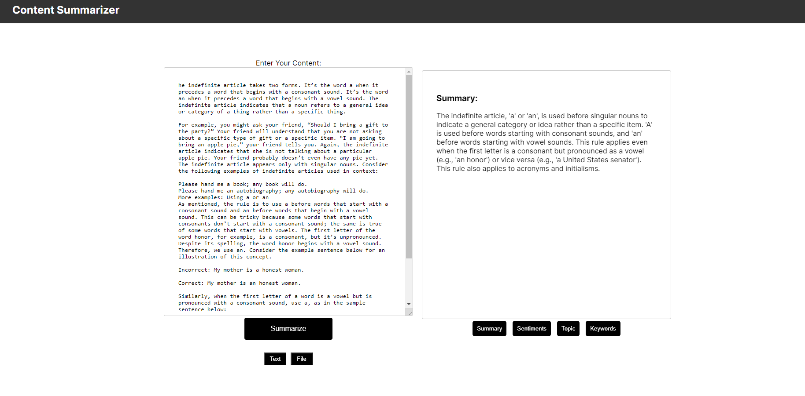

# AI-Powered Content Summarization and Analysis Tool
This application allows users to upload text content (articles, documents, emails, etc.) and receive a summarized version with key insights and analysis. 

# Features
File Upload: Supports uploading files.
AI Analysis: Integrates with AI services to perform text analysis and summarization.
Topic Information: Shows topic classification and confidence.
Keywords Extraction: Lists the keywords extracted from the text.

# Technologies Used
Frontend: Next.js, React.js
Backend: Node.js, Express.js
AI Service: Google Gemini

# Getting Started
Prerequisites
Node.js and npm installed on your machine.
Google Gemini API enabled.

# Running the Application

Start the frontend application:
npm run dev
Open your browser and navigate to http://localhost:3000.

Summary:Display summary of content in short form
Keywords: Displays the extracted keywords.
Sentiments: Shows the sentiment score and magnitude.
Topic Information: Provides topic classification.
home page

